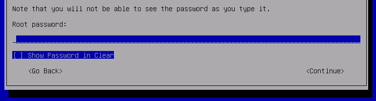
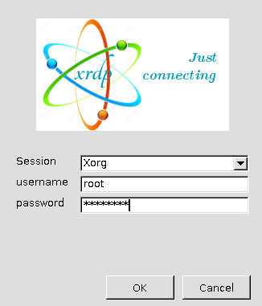
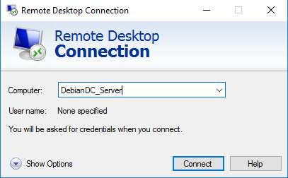
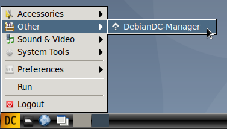
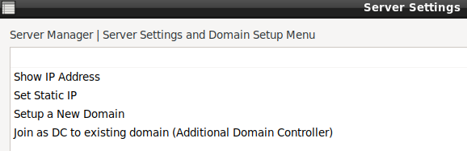
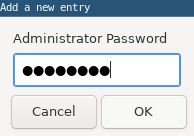
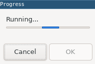
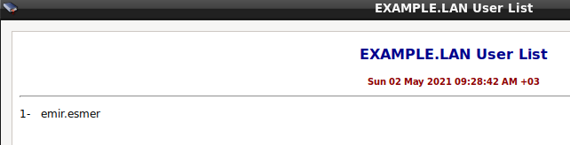
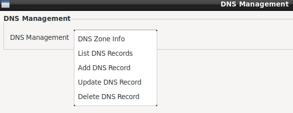
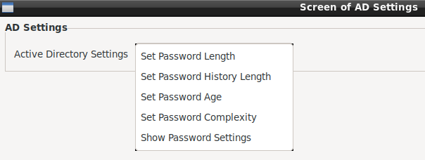

# DebianDC-Handbook / User Guide

The document contains detailed information about the use for the DebianDC Active Directory Domain Environment GUI.

- [1. Installation](#1-installation)
  - 1.1 Installing DebianDC on the ready Debian installation
  - 1.2 Installing DebianDC with DebianDC-buster-installer.iso
- [2. Access to DebianDC Host](#2-access-to-debiandc-host)
  - 2.1 Remote Desktop Access
    - 2.1.1 from Linux
    - 2.1.2 from Windows
  - 2.2 SSH
    - 2.2.1 from Linux
- [3. DebianDC Manager](#3-debiandc-manager)
  - 3.1 DebianDC-Manager Screen
    - 3.1.1 Static ip Assignment
    - 3.1.2 Setting up the Active Directory role
    - 3.1.3 Using the Manager application after domain setup
      - 3.1.3.1 User Management
      - 3.1.3.2 Group Management
      - 3.1.3.3 OU Management
      - 3.1.3.4 Computer Management
      - 3.1.3.5 DNS Management
      - 3.1.3.6 Domain Operations
      - 3.1.3.7 Active Directory Settings
 - [4. DebianDC Host Management](#4-debiandc-host_management)
      - 4.1 Manage Windows Host
 - [5. Usage Scenarios / Best Practies](#5-scenarios-practies)
 - [6. FAQ](#4-faq)
---

## 1. Installation

You can use the DebianDC application in two ways.
### 1.1- Installing DebianDC on the ready Debian installation <br>
For fresh Debian installation: https://www.debian.org/distrib/
<br>
This setup; It is made from the DebianDC repository to the existing Debian installed machine.

As the `root`: <ins>perform operations as root user.!!</ins>

```bash
wget https://raw.githubusercontent.com/eesmer/DebianDC/master/debiandc-installer.sh
```
```bash
bash debiandc-installer.sh
```
<br>

If a desktop environment is not installed in the system, the DebianDC installation installs the lxde-core desktop environment. <br>
www.lxde.org <br>
<br>
If you are installing DebianDC on a system with a desktop installed, **DebianDC Manager** is placed in the existing desktop application menu. <br>

### 1.2- Installing DebianDC with DebianDC-buster-installer.iso
This installation is done automatically from the installer.iso file.
Auto install creates shortcuts for lxde-core desktop and DebianDC-Manager application on Debian distribution.
To install, it is sufficient to attach the installer.iso file to the machine.
The setup itself will do the rest.

**You can download the debiandc_buster_installer.iso file from this link.**<br>
https://sourceforge.net/projects/debiandc/files/latest/download
<br>


The screen that started the installation.<br>
You can start the installation by pressing the enter button on this screen.


You can continue by adjusting the location and keyboard settings.


You can set a machine name


The domain name is asked after the machine name.<br>
Leave this blank



Set password for root user<br>
You will be logged into the system by this


At this stage, the installation will start and then it will ask you to set the repo address for the package archive.


You can make the best choice according to your location and continue.
The installation will then continue and complete without asking any further questions.
<br>

After the installation is complete
You can log in with the root user you specified during the installation.


## 2. Access to DebianDC Host
DebianDC is configured with XRDP for remote desktop access support.<br>
Remote desktop access can be made with any RDP client.<br>
www.xrdp.org
### 2.1 Remote Desktop Access
#### 2.1.1 From Linux
```
xfreerdp /w:1366 /h:768 /v:DebianDC_Server:3389
```


#### 2.1.2 From Windows



#### 2.2 SSH
```
ssh -p22 DebianDC_server
```
You can console access to the DebianDC server via SSH. <br>
You can use TUI as an alternative to DebianDC GUI. <br>
<br>

```
wget https://raw.githubusercontent.com/eesmer/sambad-tui/master/sambadtui.sh
```
```
bash sambadtui.sh
```

## 3. DebianDC-Manager
You can access the Manager application from the opened DebianDC desktop environment.



### 3.1- DebianDC-Manager Screen
After the DebianDC desktop installation, the Active Directory role must be installed.
When you open the Manager application, a menu will open with setup and configuration options if Active Directory Role is not installed.



`Important Notice`: <ins> You must give a static IP to the DC machine. </ins>

#### 3.1.1- Static ip assignment
The IP address of the DC machine must be fixed.
Otherwise, the changed ip address later may cause the Active Directory role to not work.


DebianDC will prompt you to reboot for ip definition to take effect.

#### 3.1.2- Setting up the Active Directory role
Active Directory Role can be installed after fixed ip definition.
The installation of this role is done with the "Setup a New Domain" option from the same menu.

The process of installing the AD role;
It asks for the new name of the machine, the domain name to be installed, and the password of the Administrator user, respectively.




After getting the information required to install the role, a screen will appear asking for confirmation for installation.
After the confirmation of this screen, the Active Directory role installation begins.


<br>


When the installation is complete, DebianDC will ask for a reboot.
After DebianDC restarts, you can log in with the root user and use the manager application.

Once the Domain setup is complete and DebianDC restarts, log in again.
You can now use the Manager application with its new menus.


### 3.1.3 Using the Manager application after domain setup
The DebianDC-Manager application is used by obtaining a kerberos ticket.
For this reason, if you do not have a kerberos ticket, the Manager will ask you for the Administrator user password when opening the Kerberos ticket.
(Administrator password is the password you entered when setting up the domain.)
Thus, it can be used in menus that require Administrator password without entering a password.

#### 3.1.3.1 User Management
This screen is where Active Directory user management is done.


From this menu,
can create new users, user can delete, can determine the duration of stay active, can disable the use of the user account, <br>
can set new password or force password change, and you can get the list of the user accounts.
<br>
<br>
opening a new user account<br>


<br>
<br>
active directory user account list<br>


### 3.1.3.2 Group Management
This screen is where Active Directory group management is done.


From this menu
You can create a group, delete the group, add members to the group, remove the group, group list and member list report can be obtained.

### 3.1.3.3 OU Management
This screen is where Active Directory organization unit management is done.


From this menu
You can create and delete organizational units, Members can be added to or removed from organizational units, OU list and OU member list report are created.

### 3.1.3.4 Computer Management
This screen is where Active Directory Computer Management is done

From this menu
List of Domain Controller machines can be taken, A list of computer accounts that are members of the domain can be retrieved, Moving computer accounts between OUs
and the computer account can be removed.


### 3.1.3.5 DNS Management
This screen is where Active Directory DNS management is done.

From this menu
DNS Zone information can be obtained, DNS records can be added, deleted and updated



### 3.1.3.6 Domain Operations
This screen is where domain operations is done

There are 2 menus on this screen.
From the Domain Controller Operations screen; DC machine can be removed and dropped from the environment.
From the FSMO Operations screen; FSMO roles can be transferred to DC machines.

  

The operations here will be covered in detail in the Sample Scenarios and Best Practies title.

### 3.1.3.7 Active Directory Settings
This screen is where Active Directory settings is done

This menu
For user accounts; Password complexity, length, expiration time, etc. are set.



## 4. DebianDC-Host_Management
Host machines can be managed from this menu.<br>
The purpose of this screen; is to try to make daily work from central point.

### 4.1 Windows Host Management
DebianDC accesses the Windows machine with ansible and winrm.<br>
To use this feature on a Windows machine, the following steps are required.<br>
<br>
**download:** https://raw.githubusercontent.com/ansible/ansible/devel/examples/scripts/ConfigureRemotingForAnsible.ps1 <br>
save this .ps1 content to the Administrator desktop on the Windows machine
Example filename: debiandc_config.ps1<br>
**run:** Then you can run it from the powershell screen.
```
PS C:\Users\Administrator> cd .\Desktop\
PS C:\Users\Administrator\Desktop> powershell.exe .\debiandc_config.ps1
```
**control:** in the powershell screen
```
winrm enumerate winrm/config/Listener
```
in the output of the command;<br>
It should be seen that the HTTP:5985 and HTTPS:5986 ports are in listening mode.<br>
<br>
After these processes, you can use the Windows host machine over DebianDC.<br>
You can use a special user account or Administrator account for access with winrm.
<br>
<br>

<br>
<br>
### use of Ping Action


