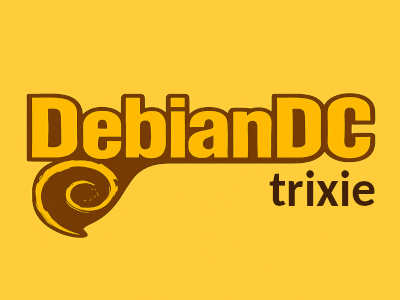
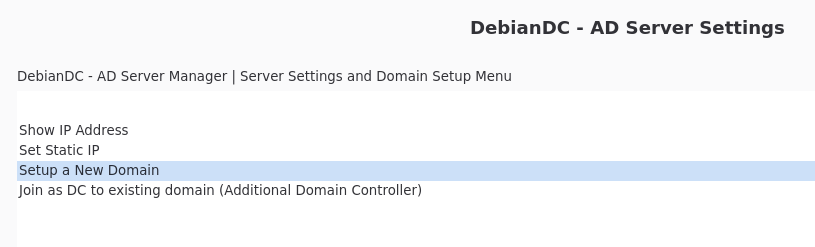

# DebianDC

### Samba Active Directory Graphic Interface Environment 
DebianDC provides a graphical interface environment for Samba Active Directory. 
You can install a new domain environment with DebianDC or manage your existing Samba AD environment. 

---

## 🎛️ Project Purpose
- Automatic installation via Custom ISO - [Download](https://sourceforge.net/projects/debiandc/files/latest/download "DebianDC latest download link")
- Simple interface with desktop environment (openbox)
- Samba Active Directory installation and management screens
- Provides GUI with Zenity interface

## 📦 Content and Features
- Easy installation based on Debian.
- Samba Active Directory Domain Controller installation.
- Configuration of DNS, Kerberos and related services.
- Zenity based visual management tools.
- Ready to use after installation.

## 📷 Key Features
- Domain and Domain Controller setup
- DC or ADDC setup (New Domain or join to existing domain)
- User Management
- Group Management
- OU Management
- Computer Management
- DNS Management
- Domain Operations (demote DC, fsmo management etc.)
- AD Settings Management (password policy, age, settings etc.)
- Reports

## 🛠️ Requirements
- Computer with x86_64 architecture.
- Minimum 2 CPUs, 2 GB RAM, 20 GB disk space.
- UEFI or Legacy BIOS support.

---

---

## 📚 Development Documentation
- [Architecture overview](https://github.com/eesmer/DebianDC/blob/master/Documentation/architecture/overview.md)
- [Technical decisions (ADRs)](https://github.com/eesmer/DebianDC/blob/master/Documentation/decisions/README.md)

## 📚 Help Documents
#### 📚 [Installation Guide](https://github.com/eesmer/DebianDC/blob/master/Documentation/guides/installation/installation_from_iso.md)
#### 📚 [Mastering Samba Active Directory E-Book](https://github.com/eesmer/Mastering-SambaActiveDirectory)

---

### Issues
The [Issues](https://github.com/eesmer/DebianDC/issues) section of this GitHub repository
