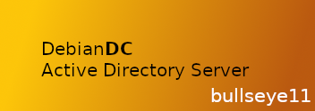
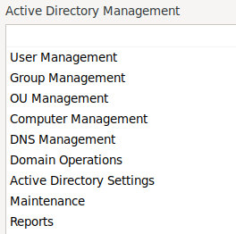
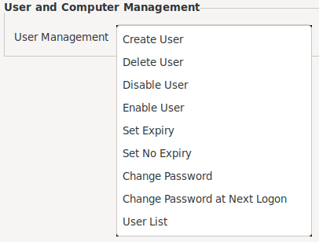

<br>
# DebianDC
### Samba Active Directory Graphic Interface Environment<br>
DebianDC provides a graphical interface environment for Samba Active Directory.<br>
You can install a new domain environment with DebianDC or manage your existing Samba AD environment.<br>




## Features
- Domain and Domain Controller setup
- DC or ADDC setup (New Domain or join to existing domain)
- User Management
- Group Management
- OU Management
- Computer Management
- DNS Management (BIN9_DLZ)
- Domain Operations (demote DC, fsmo management etc.) continues yet.
- AD Settings Management
- Reports (more detailed reports than the listing process)

## Requirements
*This work has been done on Debian distribution. (Debian10 buster)<br>

## Installation and Usage
#### A few different ways to use DebianDC
- If you do not have a Domain environment, you can set up a Domain environment with DebianDC and manage it with the interface it provides.
- If you already have a Samba AD environment, you can install DebianDC on the current DC machine and get the management GUI.
```sh
$ wget https://raw.githubusercontent.com/eesmer/DebianDC/master/debiandc-installer.sh
$ bash debiandc-installer.sh
```
Use DebianDC and manager screen with root user
#### Domain Setup and use Active Directory Environment
Run the manager command from the terminal screen
```sh
$ manager
```
[Manager Interface User Guide](https://github.com/eesmer/DebianDC/blob/master/manager-UserGuide.md)

#### You can also use DebianDC with non-desktop Debian
Requires DebianDC X environment. However, this is not a desktop environment requirement.<br>
You can access the non-desktop DebianDC as follows.
```sh
ssh -X -p40022 root @ DebianDC
```

