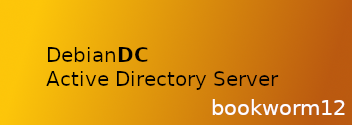
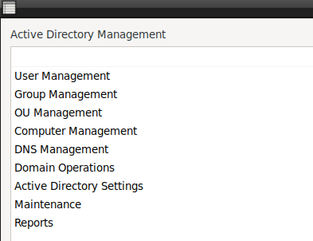
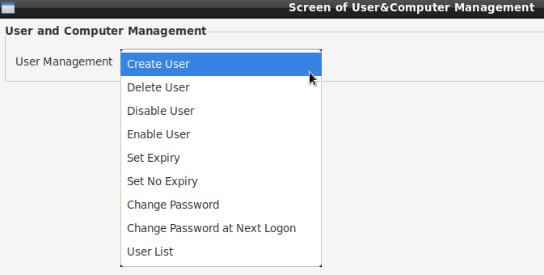

 
# DebianDC
### Samba Active Directory Graphic Interface Environment 
DebianDC provides a graphical interface environment for Samba Active Directory. 
You can install a new domain environment with DebianDC or manage your existing Samba AD environment. 

## Features
- Domain and Domain Controller setup
- DC or ADDC setup (New Domain or join to existing domain)
- User Management
- Group Management
- OU Management
- Computer Management
- DNS Management (BIN9_DLZ)
- Domain Operations (demote DC, fsmo management etc.)
- AD Settings Management (password policy, age, settings etc.)
- Reports

#### Use the manual for installation
https://github.com/eesmer/DebianDC/blob/master/DebianDC-Handbook.md
