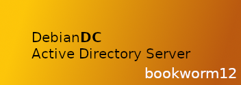

 
# DebianDC
### Samba Active Directory Graphic Interface Environment 
DebianDC provides a graphical interface environment for Samba Active Directory. 
You can install a new domain environment with DebianDC or manage your existing Samba AD environment. 

 

## Key Features
- Domain and Domain Controller setup
- DC or ADDC setup (New Domain or join to existing domain)
- User Management
- Group Management
- OU Management
- Computer Management
- DNS Management
- Domain Operations (demote DC, fsmo management etc.)
- AD Settings Management (password policy, age, settings etc.)
- Reports
### Other Additional Features
- Centralized management of Windows client and host machines
    - install and uninstall .msi package
---

## Help

  
[Installation Guide](https://github.com/eesmer/DebianDC/blob/master/docs/DebianDC-UserGuide/installation/installation.md)

  
[User Guide](https://github.com/eesmer/DebianDC/blob/master/docs/DebianDC-UserGuide/DebianDC-UserGuide.md)

#### Issues
The [Issues](https://github.com/eesmer/DebianDC/issues) section of this GitHub repository

---
#### DebianDC Best Practices & Active Directory Concepts Documentation
[DebianDC Documentation](https://github.com/eesmer/DebianDC/blob/master/docs/DebianDC-Docs.md)
