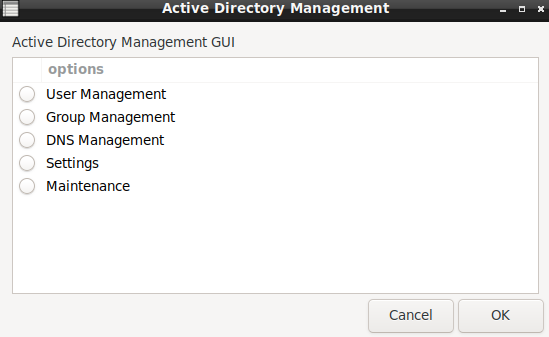

# DebianDC
Domain Controller and Samba AD Graphic Interface Environment<br>
DebianDC provides a Domain Controller installation and graphical interface manage environment for Samba Active Directory.<br>
DebianDC installs a graphical interface called AD-Manager and manages the Active Directory environment with zenity screens.<br>




## Features
- Domain and Domain Controller setup
- User Management
- Group Management
- Computer Management
- OU Management
- DNS Management (BIN9_DLZ)
- Reports (more detailed reports than the listing process)

## Requirements
*This work has been done on Debian distribution. (Debian10 buster)<br>

## Installation and Usage
```sh
$ wget https://raw.githubusercontent.com/eesmer/DebianDC/master/debiandc-installer.sh
$ bash debiandc-installer.sh
```
Use DebianDC and manager screen with root user
#### Domain Setup and use Active Directory Environment
Run the manager command from the terminal screen
```sh
$ manager
```
#### You can also use DebianDC with non-desktop Debian
Requires DebianDC X environment. However, this is not a desktop environment requirement.
You can access the non-desktop DebianDC as follows.
```sh
ssh -X -p40022 root @ DebianDC
```

