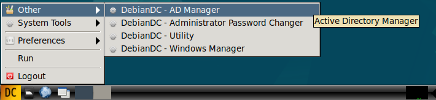

# DebianDC

### Samba Active Directory Graphic Interface Environment 
DebianDC provides a graphical interface environment for Samba Active Directory. 
You can install a new domain environment with DebianDC or manage your existing Samba AD environment. 

---

## 🎛️ Project Purpose
- Automatic installation via Custom ISO.
- Simple interface with desktop environment (LXDE).
- Samba Active Directory installation and management.
- Provides GUI with Zenity interface.

## 📦 Content and Features
- Easy installation based on Debian.
- Samba Active Directory Domain Controller installation.
- Configuration of DNS, Kerberos and related services.
- Zenity based visual management tools.
- LXDE Desktop environment support.
- Ready to use after installation.

## 🛠️ Requirements
- Computer with x86_64 architecture.
- Minimum 2 CPUs, 2 GB RAM, 20 GB disk space.
- UEFI or Legacy BIOS support.

---

 

## 📷 Key Features
- Domain and Domain Controller setup
- DC or ADDC setup (New Domain or join to existing domain)
- User Management
- Group Management
- OU Management
- Computer Management
- DNS Management
- Domain Operations (demote DC, fsmo management etc.)
- AD Settings Management (password policy, age, settings etc.)
- Reports
### Other Additional Features
- Centralized management of Windows client and host machines
    - install and uninstall .msi package

---

# Help and Documentation

  
#### [Installation Guide](https://github.com/eesmer/DebianDC/blob/master/docs/DebianDC-UserGuide/installation/installation.md)

 

  
#### [User Guide](https://github.com/eesmer/DebianDC/blob/master/docs/DebianDC-UserGuide/DebianDC-UserGuide.md)

---

#### Issues
The [Issues](https://github.com/eesmer/DebianDC/issues) section of this GitHub repository

---

# Book

#### Samba Active Directory Best Practies with DebianDC
  

#### [Samba AD best practices with DebianDC](https://github.com/eesmer/DebianDC/blob/master/docs/DebianDC-Docs.md)
