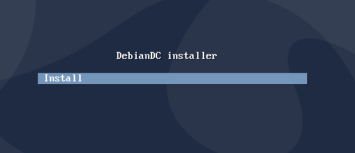
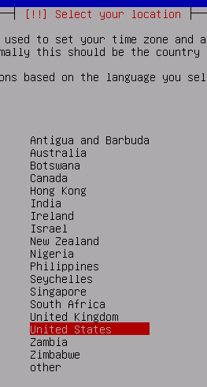
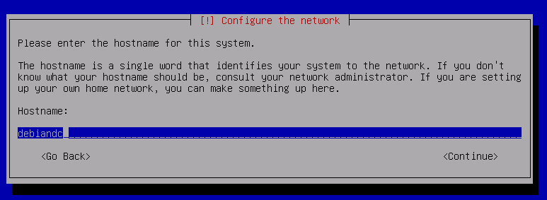
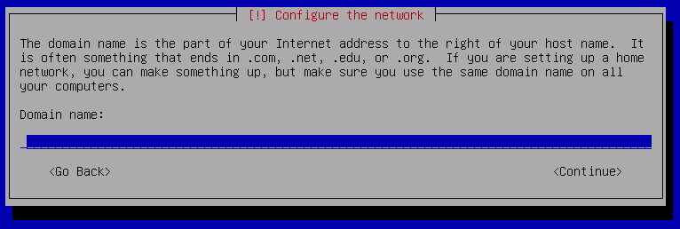
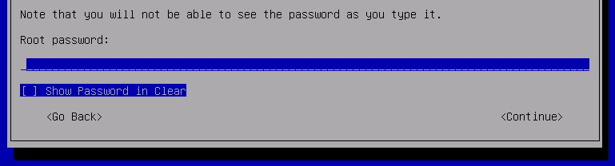
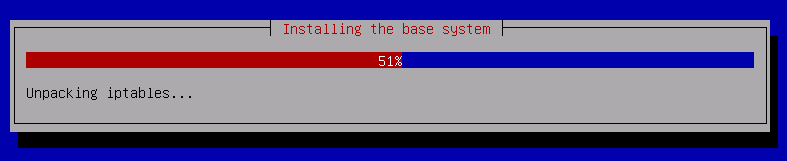
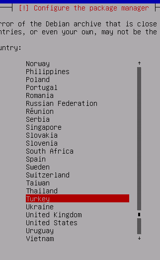

## Installation

You can use the DebianDC application in two ways. <br>
<br>
<br>
### 1- Installing DebianDC on the ready Debian installation <br>
For fresh Debian installation: https://www.debian.org/distrib/
<br>
This setup; It is made from the DebianDC repository to the existing Debian installed machine.

As the `root`: <ins>perform operations as root user.!!</ins>

```bash
wget https://raw.githubusercontent.com/eesmer/DebianDC/master/debiandc-installer.sh
```
```bash
bash debiandc-installer.sh
```
<br>

If a desktop environment is not installed in the system, the DebianDC installation installs the lxde-core desktop environment. <br>
www.lxde.org <br>
<br>
If you are installing DebianDC on a system with a desktop installed, **DebianDC ADManager** is placed in the existing desktop application menu. <br>

### 2- Installing DebianDC with DebianDC-buster-installer.iso
This installation is done automatically from the installer.iso file.
Auto install creates shortcuts for lxde-core desktop and DebianDC-ADManager application on Debian distribution.
To install, it is sufficient to attach the installer.iso file to the machine.
The setup itself will do the rest.

**You can download the debiandc_buster_installer.iso file from this link.**<br>
https://sourceforge.net/projects/debiandc/files/latest/download
<br>



The screen that started the installation.<br>
You can start the installation by pressing the enter button on this screen.



You can continue by adjusting the location and keyboard settings.



You can set a machine name



The domain name is asked after the machine name.<br>
Leave this blank



Set password for root user<br>
You will be logged into the system by this



At this stage, the installation will start and then it will ask you to set the repo address for the package archive.



You can make the best choice according to your location and continue.
The installation will then continue and complete without asking any further questions.
<br>

After the installation is complete
You can log in with the root user you specified during the installation.


<br>

[DebianDC-UserGuide](https://github.com/eesmer/DebianDC/blob/master/DebianDC-UserGuide.md)
