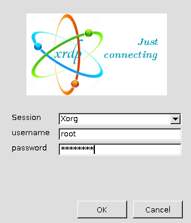

## Access to DebianDC Host
DebianDC is configured with XRDP for remote desktop access support.<br>
Remote desktop access can be made with any RDP client.<br>
www.xrdp.org
### 1- Remote Desktop Access
#### From Linux
```
xfreerdp /w:1366 /h:768 /v:DebianDC_Server:3389
```


#### From Windows


### 2- SSH
```
ssh -p22 root@DebianDC_server
```
You can console access to the DebianDC server via SSH. <br>
You can use TUI as an alternative to DebianDC GUI. <br>
<br>

```
wget https://raw.githubusercontent.com/eesmer/sambad-tui/master/sambadtui.sh
```
```
bash sambadtui.sh
```
### 2- RSAT Tool for alternative GUI usage
You can connect to the Active Directory Domain environment with the Windows RSAT tool, which can be installed on some Windows versions. <br>
RSAT is the same as the Microsoft Active Directory usage screen. <br>
<br>
You can see the link below for details. <br>
https://learn.microsoft.com/en-us/troubleshoot/windows-server/system-management-components/remote-server-administration-tools
