## DebianDC-ADManager
You can access the Manager application from the opened DebianDC desktop environment.
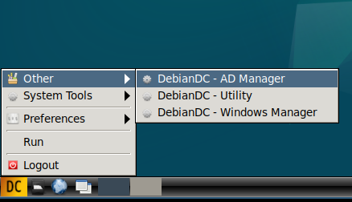
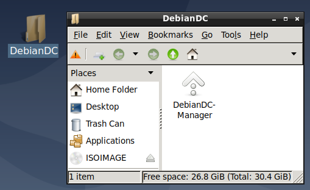

### 1- DebianDC-Manager Screen
After the DebianDC desktop installation, the Active Directory role must be installed.
When you open the Manager application, a menu will open with setup and configuration options if Active Directory Role is not installed.

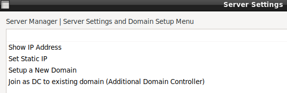

`Important Notice`: <ins> You must give a static IP to the DC machine. </ins>

#### 2- Static ip assignment
The IP address of the DC machine must be fixed.
Otherwise, the changed ip address later may cause the Active Directory role to not work.

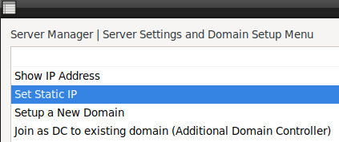
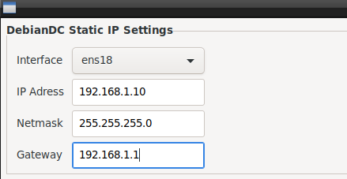

DebianDC will prompt you to reboot for ip definition to take effect.

#### 3- Setting up the Active Directory role
Active Directory Role can be installed after fixed ip definition.
The installation of this role is done with the "Setup a New Domain" option from the same menu.

The process of installing the AD role;
It asks for the new name of the machine, the domain name to be installed, and the password of the Administrator user, respectively.

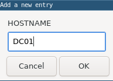
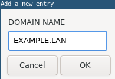
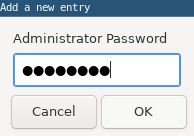

After getting the information required to install the role, a screen will appear asking for confirmation for installation.
After the confirmation of this screen, the Active Directory role installation begins.

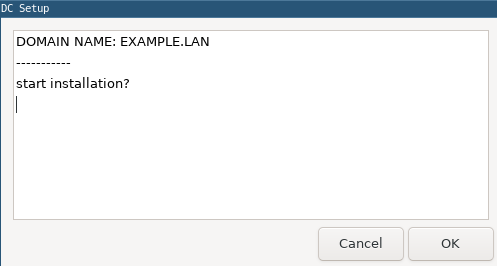
 
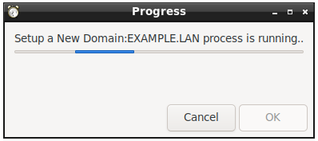

When the installation is complete, DebianDC will ask for a reboot.
After DebianDC restarts, you can log in with the root user and use the manager application.

Once the Domain setup is complete and DebianDC restarts, log in again.
You can now use the Manager application with its new menus.

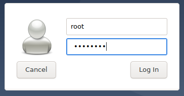

### 4- Using the Manager application after domain setup
The DebianDC-ADManager application is used by obtaining a kerberos ticket.
For this reason, if you do not have a kerberos ticket, the Manager will ask you for the Administrator user password when opening the Kerberos ticket.
(Administrator password is the password you entered when setting up the domain.)
Thus, it can be used in menus that require Administrator password without entering a password.

#### 5- User Management
This screen is where Active Directory user management is done.

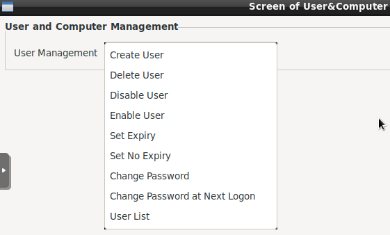

From this menu,
can create new users, user can delete, can determine the duration of stay active, can disable the use of the user account,  
can set new password or force password change, and you can get the list of the user accounts.
 
 
opening a new user account 
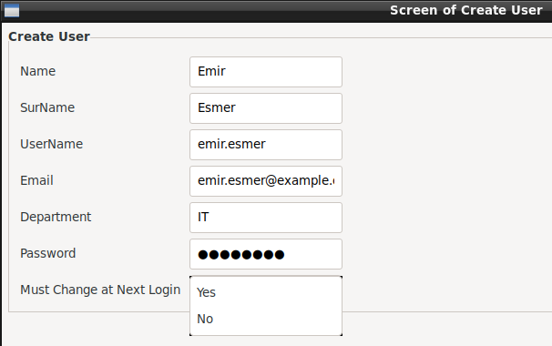
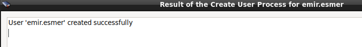
 
 
active directory user account list 
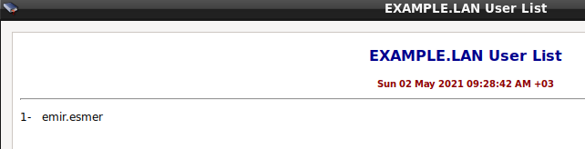

### 6- Group Management
This screen is where Active Directory group management is done.

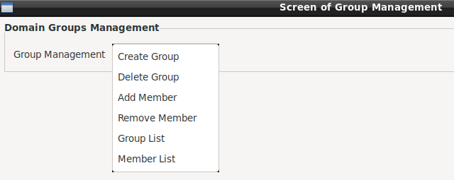

From this menu
You can create a group, delete the group, add members to the group, remove the group, group list and member list report can be obtained.

### 7- OU Management
This screen is where Active Directory organization unit management is done.

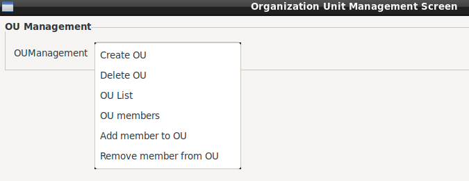

From this menu
You can create and delete organizational units, Members can be added to or removed from organizational units, OU list and OU member list report are created.

### 8- Computer Management
This screen is where Active Directory Computer Management is done

From this menu
List of Domain Controller machines can be taken, A list of computer accounts that are members of the domain can be retrieved, Moving computer accounts between OUs
and the computer account can be removed.

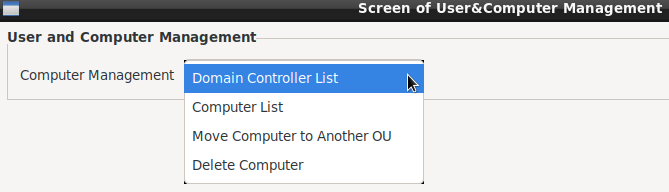

### 9- DNS Management
This screen is where Active Directory DNS management is done.

From this menu
DNS Zone information can be obtained, DNS records can be added, deleted and updated

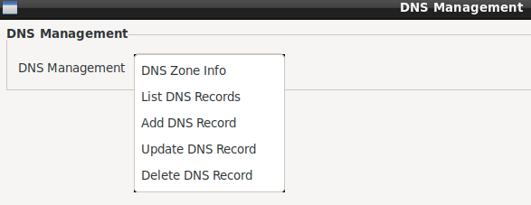

### 10- Domain Operations
This screen is where domain operations is done

There are 2 menus on this screen.
From the Domain Controller Operations screen; DC machine can be removed and dropped from the environment.
From the FSMO Operations screen; FSMO roles can be transferred to DC machines.

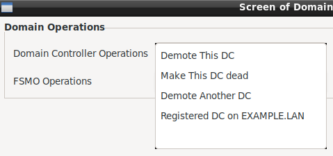 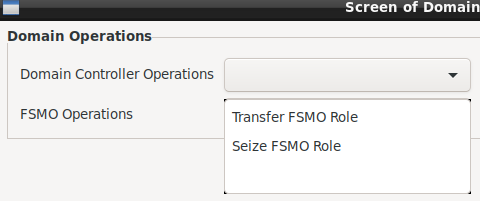 

The operations here will be covered in detail in the Sample Scenarios and Best Practies title.

### 11- Active Directory Settings
This screen is where Active Directory settings is done

This menu
For user accounts; Password complexity, length, expiration time, etc. are set.

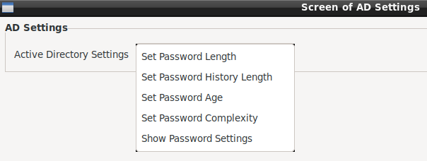
