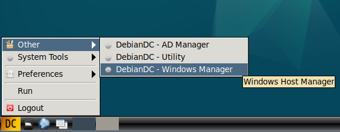
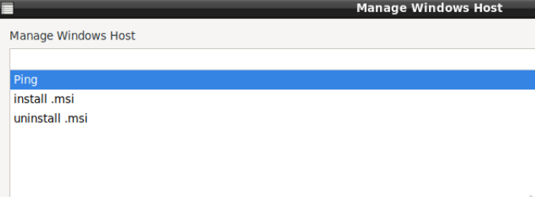
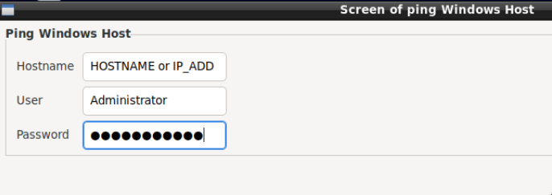
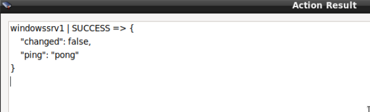

## DebianDC-Host_Management
Host machines can be managed from this menu.<br>
The purpose of this screen; is to try to make daily work from central point.

### 1- Windows Host Management
DebianDC accesses the Windows machine with ansible and winrm.<br>
To use this feature on a Windows machine, the following steps are required.<br>
<br>
**download** <br>
```
https://raw.githubusercontent.com/ansible/ansible-documentation/devel/examples/scripts/ConfigureRemotingForAnsible.ps1
```

save this .ps1 content to the Administrator desktop on the Windows machine
Example filename: debiandc_config.ps1<br>
**run:** Then you can run it from the powershell screen.
```
PS C:\Users\Administrator> cd .\Desktop\
PS C:\Users\Administrator\Desktop> powershell.exe .\debiandc_config.ps1
```
**control:** in the powershell screen
```
winrm enumerate winrm/config/Listener
```
in the output of the command;<br>
It should be seen that the HTTP:5985 and HTTPS:5986 ports are in listening mode.<br>
<br>
After these processes, you can use the Windows host machine over DebianDC.<br>
You can use a special user account or Administrator account for access with winrm.
<br>
<br>

<br>
<br>
#### use of Ping Action



