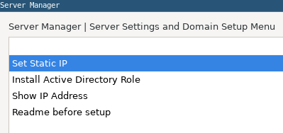
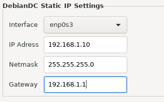
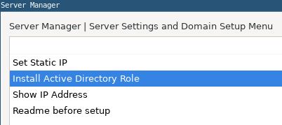
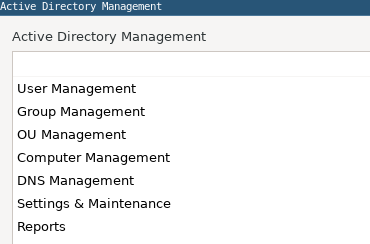

# Manager Interface
It is a graphical interface used with the manager command after installation. 
Until the Active Directory role is installed, the server management menu (Server Manager) will be active. 
After installing the Active Directory role, Active Directory management menus are used. 
 
You can continue reading the document for details.

## Server configuration and Active Directory setup with Manager

## Set static IP
DebianDC recommends configuring static IP. 
Because if the DebianDC IP address changes after the domain setup, the Active Directory environment will not work properly. 
For this reason, it is necessary to give a fixed IP Address to the DebianDC machine using this menu. 

## Install Active Directory Role
You can install the Domain and Active Directory environment by using the Install Active Directory Role menu. 
This process asks the server a new name, Domain Name, Domain Administrator password respectively. 
 

 

## Manager Main Menu
The Manager Screen that you run with the manager command will display the management menus since the Active Directory role is installed. 
If the Kerberos ticket is not available, the Administrator creates it by asking for the password and opens the manager screen. 

